# Double Happiness · 双喜牌局

A local-first, four-seat card room for two Chinese partnership classics:

- **Sheng Ji (升级 / Tractor):** two complete 54-card decks (108 cards, four jokers total), fixed partners, trump and level cards, an 8-card bottom, singles, pairs, tractors, defender-point scoring, bottom multipliers, and team progression.
- **Guan Dan (掼蛋):** two decks, fixed partners, level cards, heart-level wilds, climbing combinations, bombs, placement scoring, progression, and automatic tribute.

Every game can start immediately against three rule-based AI players, or as a private nearby-friends room. Friends on the same network scan a QR code and join from a phone—no account or cloud service required.

Choose from all 12 Chinese zodiac animals. The selected chibi avatar follows that player from room creation or QR join through the lobby, gameplay, and reconnects. Each hand also has three one-tap layouts:

- **Smart:** game-aware grouping. Guan Dan keeps wilds, bombs, triples, pairs, and singles easy to scan; Sheng Ji brings effective trump and playable pairs together.
- **Rank:** matching ranks together, strongest first.
- **Suit:** spades, hearts, diamonds, clubs, then jokers, with each suit ordered high to low.

The chosen layout is remembered separately for each game on that device.

The live table is an edge-to-edge, full-viewport felt surface rather than a decorative oval. Large-format hand cards use the entire bottom rail, center plays are scaled for at-a-glance reading, and each played set remains at its seat for a complete turn rotation before that seat acts again.

On phones, a dedicated **Sort** button opens those choices without crowding the hand. Portrait mode shows a 27-card Guan Dan hand in three rows with a verified minimum 38px exposed pitch. Phones narrower than 370px automatically use four centered rows of up to eight cards to preserve the same touch density. Rotating to landscape switches to a wider, more readable single-row rail that can be swiped horizontally, but portrait remains the recommended play surface.

A separate **Hint** button analyzes only your hand and public table information. It preselects a conservative legal play—or highlights **Pass**—and explains why, but never submits the move for you. Guan Dan hints conserve bombs and marked heart-level wilds unless the situation is urgent; Sheng Ji hints respect follow-suit shapes, protect trump, and can feed points when your partner is winning. Players can tap cards or drag across a combination with subtle haptic ticks where supported, prepare their next play while opponents act, then confirm with the separate Play button.

## Screenshots

### Launcher

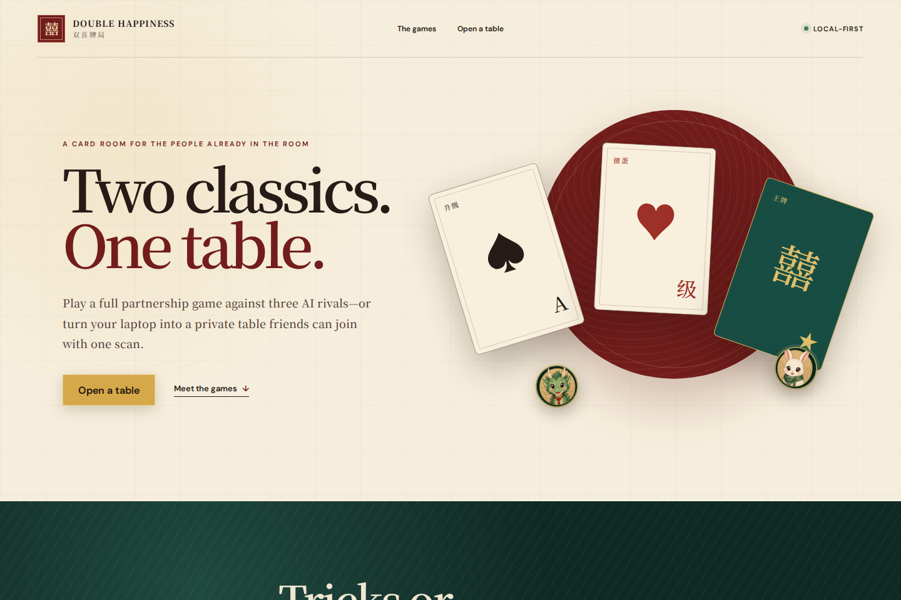

### Live game tables

| Sheng Ji | Guan Dan |
| --- | --- |
| 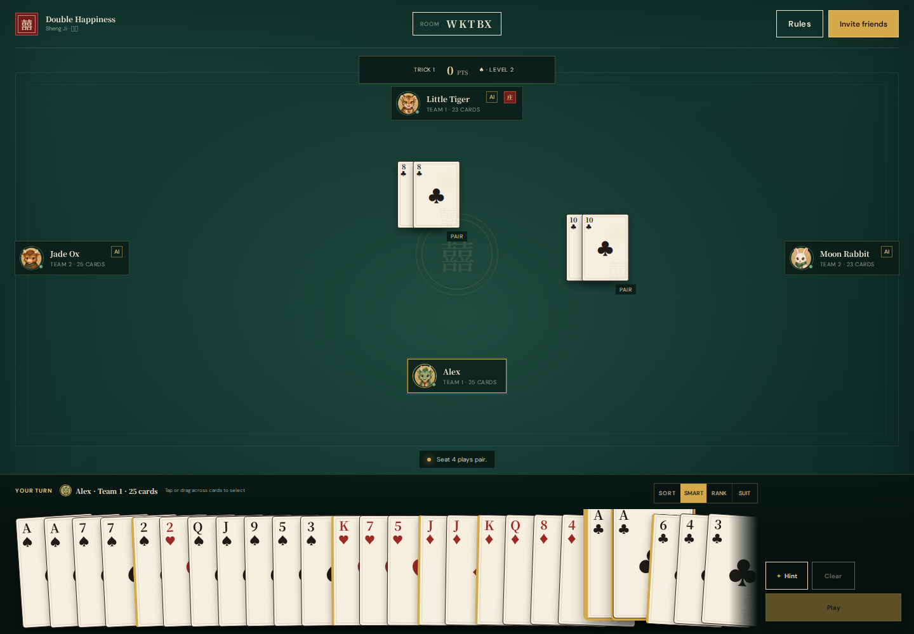 | 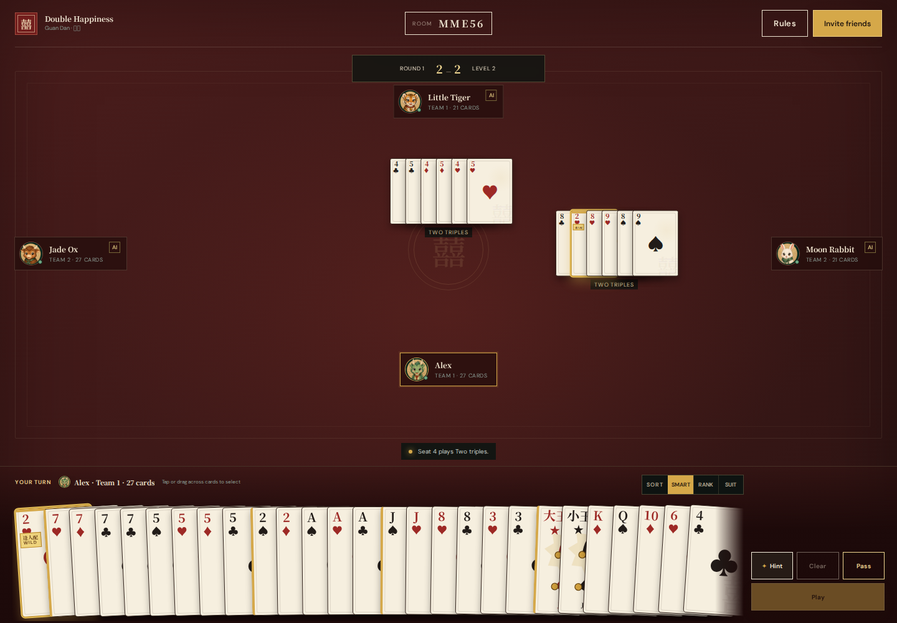 |

The same table on a 1280x720 laptop viewport, where the hand cards and every band around them scale down together:

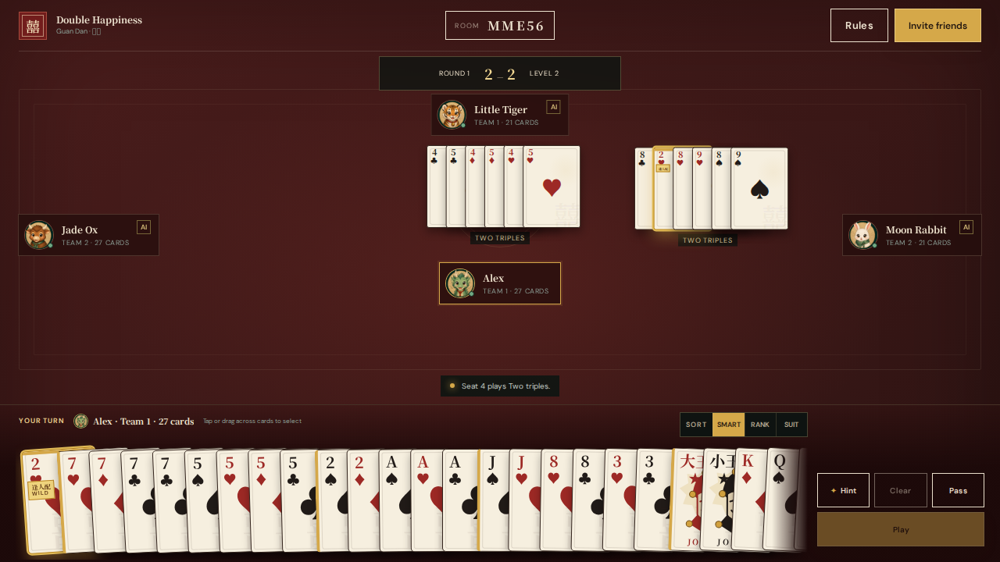

### Nearby-friends room

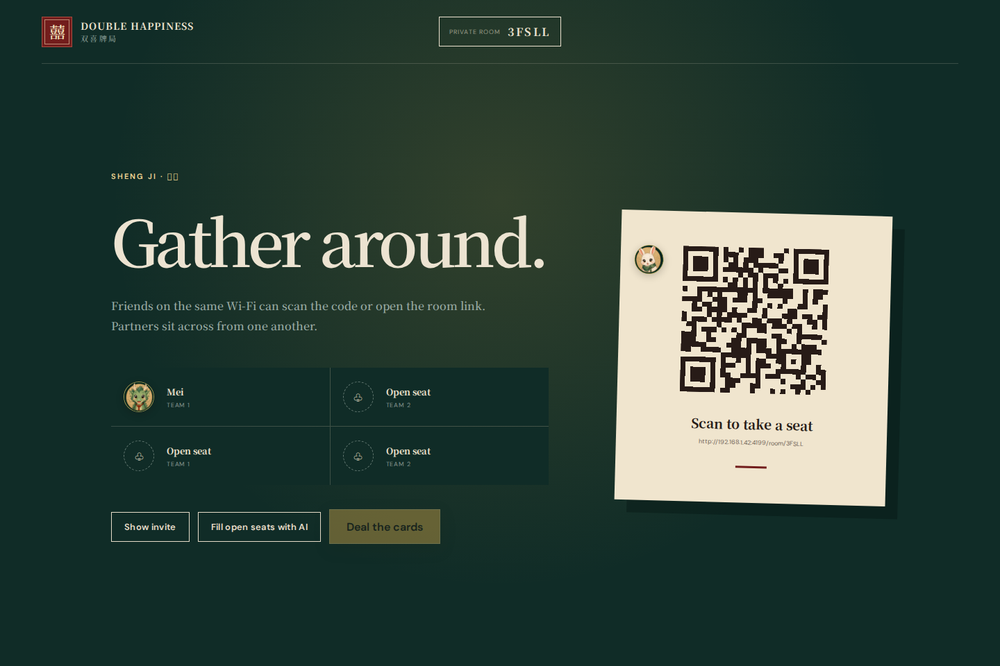

<details>
<summary>More views</summary>

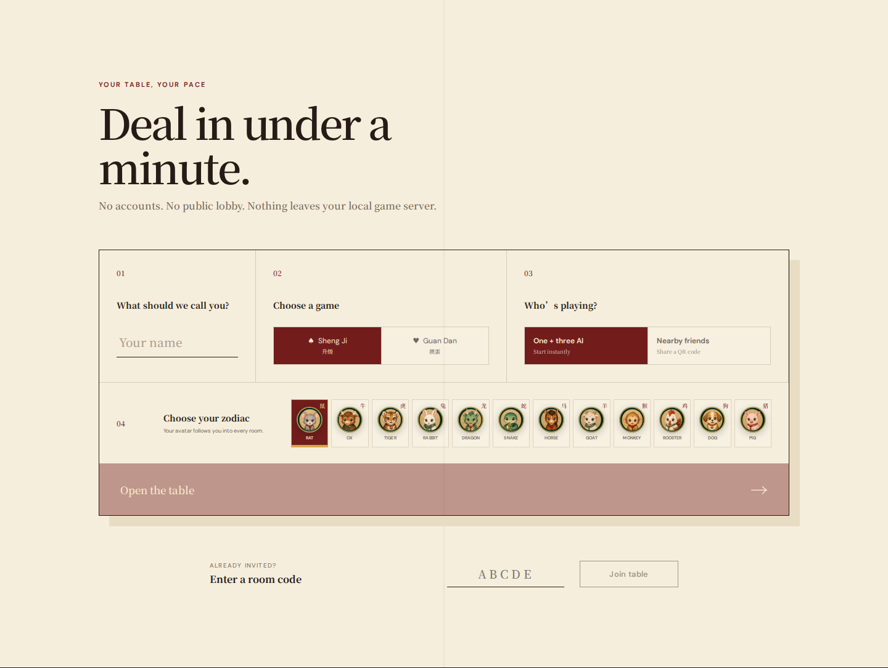

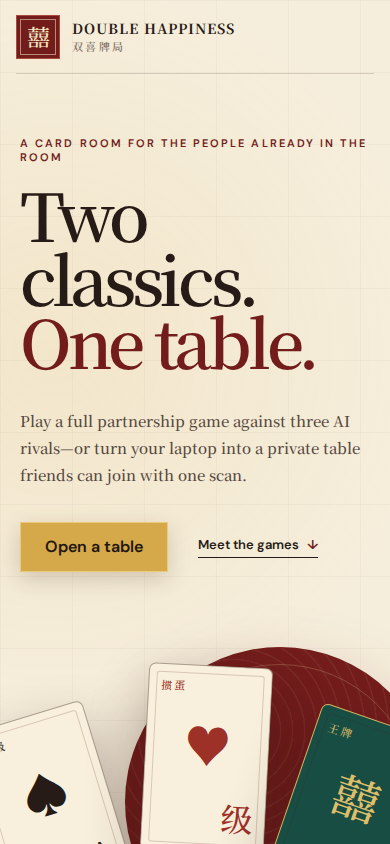

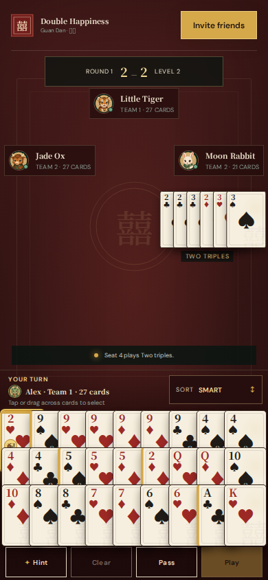

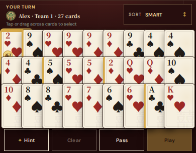

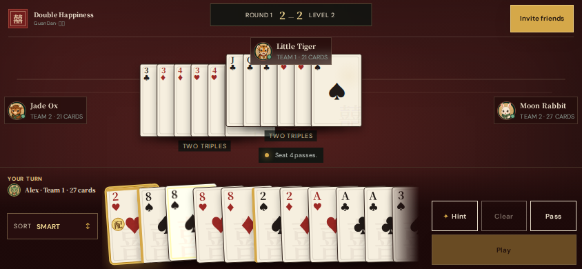

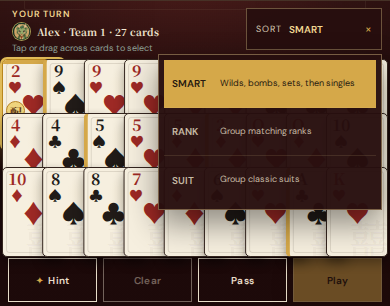

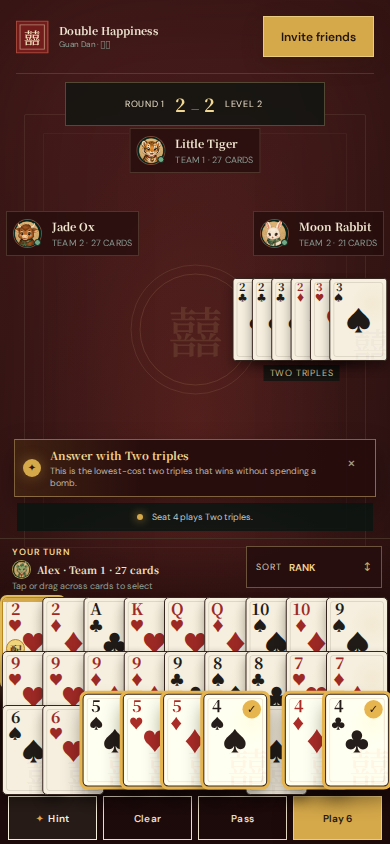

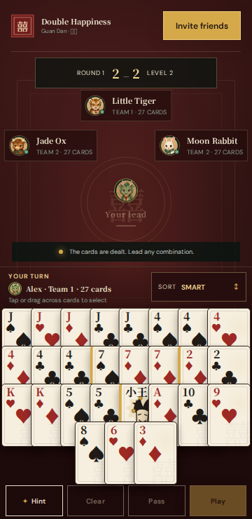

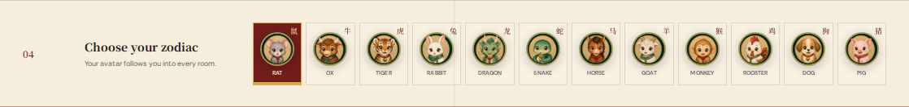

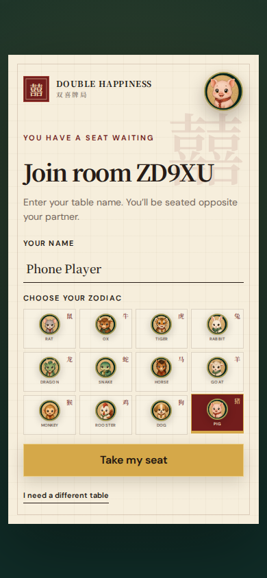

</details>

## Launch

```bash
cd card-games
npm ci --include=dev
npm run dev
```

Open `http://localhost:5173` while developing. The terminal also prints the LAN address friends should use.

For the single production server, keep the development dependencies installed because TypeScript and Vite are required to create the production bundle:

```bash
npm run build
npm start
```

If `node_modules` was installed with development dependencies omitted, run `npm ci --include=dev` before building.

Open `http://localhost:4173`. The server prints a `Friends:` URL and encodes that address in room QR codes. If automatic network detection selects the wrong interface, set the URL explicitly:

```bash
PUBLIC_URL=http://192.168.1.25:4173 npm start
```

The host computer and phones must be on the same network. Allow inbound TCP port `4173` through the host firewall if prompted.

## How rooms work

1. Enter a table name and choose Sheng Ji or Guan Dan.
2. Choose **One + three AI** for an immediate game, or **Nearby friends**.
3. In a friends room, share the QR code or five-character room code.
4. The host can fill any open seats with AI, then deal.
5. Partners always sit opposite: seats 1 and 3 versus seats 2 and 4.

The server is authoritative: each browser receives only its own hand, legal moves are checked server-side, and reconnect tokens are kept in that browser’s local storage. Rooms and matches live in server memory and reset when the process restarts.

## Rules edition

Both games have regional and family variants. This project deliberately uses one visible **House rules v1** edition so humans and AI cannot disagree mid-hand. The in-game Rules sheet describes the active edition.

The implementation follows the mainstream structure documented by [Pagat’s Guan Dan rules](https://www.pagat.com/climbing/guan_dan.html), [Pagat’s Tractor family rules](https://www.pagat.com/kt5/pengyou.html), and the [UC Berkeley ShengJi+ rules overview](https://digicoll.lib.berkeley.edu/record/275119/files/EECS-2023-127.pdf), with automatic setup and tribute to keep local games moving.

In Guan Dan, only the two heart cards matching the active level are wild; the table marks them with a gold 逢人配 / WILD treatment. They cannot represent jokers. A straight flush sits between five- and six-card bombs, while the four-joker bomb is highest.

Current deliberate boundaries:

- Four players, two decks, fixed partnerships.
- In-memory single-server rooms; no public matchmaking or persistent accounts.
- Rule-based AI optimized for legal, brisk local play—not expert tournament strategy.
- Sheng Ji leads support singles, exact pairs, and tractors. Multi-pattern “throw” leads are reserved for a later rules edition because regional validation differs.

## Verification

```bash
npm run typecheck
npm test
npm run build
node scripts/smoke-room.mjs
```

The tests cover deck integrity, Guan Dan combination/bomb/wild logic, Sheng Ji trump/pair/tractor logic, deterministic and legal Best Play recommendations, smart-layout group boundaries, full deterministic all-AI rounds for both games, and a live Socket.IO smoke that creates friend rooms, joins a second browser, fills AI seats, and starts each game.

## Refresh screenshots

The gallery is generated from real browser sessions. Install the Playwright browser once, then run the capture:

```bash
npx playwright install chromium
npm run screenshots
```

The script builds the production app, starts an isolated server on port `4199`, creates real rooms for both games, waits for the human turn, and replaces the fifteen images in `docs/screenshots/`. Browser checks verify the full-viewport desktop surface, height-appropriate desktop hand and center cards, a hand rail that is centered when it fits and edge-faded plus fully scrollable when it does not, a single non-truncating hand header, a status stack (seat badge, hint, last action) that never overlaps or is painted over - all re-run at 1440x800 and 1280x720 laptop viewports - 3-row standard-phone and 4-row narrow-phone layouts at a minimum 38px pitch, 44px action targets, corrected Hint/status placement, drag-across selection, off-turn selection persistence, and Best Play selection without automatic submission. Landscape verifies a readable 32px-or-better card pitch, horizontal scrolling, and no unintended vertical scrolling. The harness also verifies that a phone player’s chosen zodiac survives joining and appears at the table. Guan Dan captures deliberately wait for a hand containing a heart-level wild card so its special treatment remains visually covered.

## Project map

```text
games/          Pure TypeScript card and game engines
server/         Express + Socket.IO authoritative room server
shared/         Network-safe room and action types
src/            React launcher, animal artwork, waiting room, QR flow, and game table
scripts/        Live room smoke checks and reproducible browser captures
docs/           Screenshot gallery assets
```
